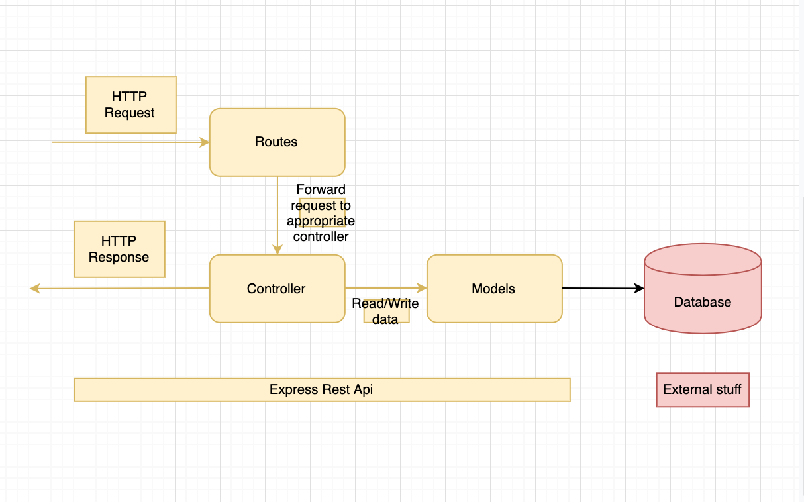
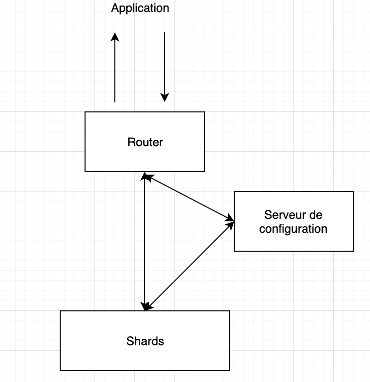

# MBA - Optimisation et Performance

## 1. Récupérer le projet sur git

	- Rendez-vous a l'adresse suivante: https://github.com/ArnaudBnd/mds_m1_b-n-d-_arnaud_optimperf
	- Téléchargez mon projet

## 2. MongoDB Atlas création

	- Rendez vous sur https://www.mongodb.com/cloud/atlas
	- Créer vous un compte
	- Créer un projet 
	- Cliquez sur le bouton 'Build a New Cluster'

Par défaut, sur le cluster gratuit nous avons 512Mo d'espace.

	- Ensuite, entrez le nom d'utilisateur et le mot de passe pour une connexion administrateur
	- Cliquez sur confirmer et déployer

Cela va prendre 10 minutes le temps que le cluster de base de donnée ce configure.
FIN.

## 3. Connection au cluster et récupération de l'URI

	- Cliquez sur 'Clusters' dans la rubrique 'ATLAS'
	- Cliquez sur 'connect'
	- Cliquez sur 'Connect your application'
	- Cliquez sur 'Allow Access from Anywhere'
	- Rentrez IP suivante: 0.0.0.0/0 pour autoriser l'accès de n'importe ou 
	- Une 'URI de connection string' apparait, copiez la
	- Sur cette URI remplacez le PASSWORD par le votre précédement crée

Cette URI devra etre remplacé par la mienne lors de vos teste.

Dans le projet récupéré sur git,

	- Allez dans le fichier '.env-sample'
	- Ecrivez votre password et URL apres les "="
	- Renommer le fichier '.env-sample' par '.env' pour appliquer les modifications
	- Puis éxécutez la commande: 'npm run start'

## 4. Explication de l'application

	- Mongoose: est un client qui nous aide à nous connecter et à communiquer avec notre base de données.

	- BodyParser: est nécessaire en tant que middleware pour analyser les données à envoyer via des requêtes HTTP.

	- Express: est un framework pour construire des applications web basées sur Node.js. C'est de fait le framework standard pour le développement de serveur en Node.js.

	- Nodemon: surveillera toute modification apportée et redémarrera le serveur si nécessaire.

	Schéma:

	

## 5. Schema de l'architecture

	- shards: un shard contient un sous ensemble de données. Les shards sont au centre de la scalabilité horizontale du cluster. Pour l’agrandir, il suffit d’ajouter des shards.

	- Router: Une instance mongos permet de router les requêtes vers le shard approprié, elle agit à la fois comme routeur et équilibreur de charge. Elle joue le rôle d’interface entre l’application cliente et le sharded cluster. Le routeur communique avec le serveur de configuration pour connaitre la répartition des données et donc choisir le bon shard.

	- Serveur de configuration: Il stocke les métadonnées et les paramètres de configuration du cluster. Il est en charge de la localisation des données, il sait quelles données se trouvent sur quels shards.

